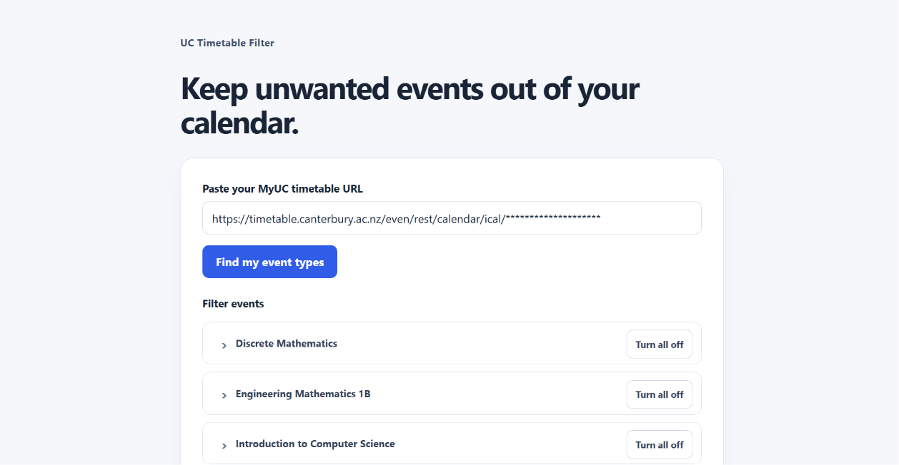
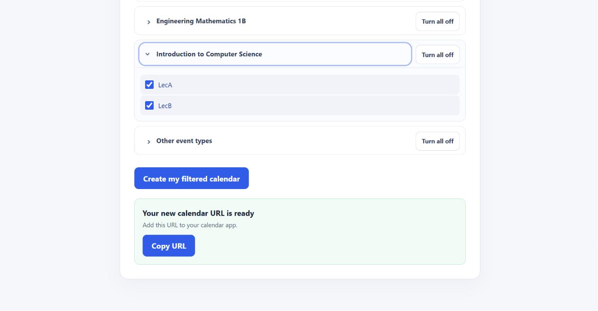

# Timetable Filter

A small Go server that creates new calendar iCal links and stores optional filter settings. The links currently return the original calendar unchanged.

## Why I made this

I started this project to help a friend whose timetable had become cluttered with events he didn't need. I made this to help him out, and to learn along the way.

## Screenshots

Paste in a MyUC timetable URL and choose which event types to keep:



The app then provides a calendar URL to copy into a calendar app:



## Start locally

Requirements: Go 1.23 or newer and a C compiler for the SQLite driver.

```powershell
go run ./cmd/server
```

The server creates and reuses one encryption key in your per-user config folder, then opens `http://127.0.0.1:8080` in your browser. Leave the terminal open while using the site; press Ctrl+C to stop it.

Set `ADDR` to change the listen address, `TIMETABLE_DB_PATH` to move the SQLite file, `TIMETABLE_KEY_FILE` to choose another key path, and `OPEN_BROWSER=false` for a headless run. For a deployment behind HTTPS, set `PUBLIC_BASE_URL` to its origin.

## Deploy to Railway

Railway can build this repository using the included `Dockerfile`. The app uses Railway's `PORT` and listens on all interfaces when that variable is present; without it, the local `127.0.0.1:8080` default remains in effect. The container disables browser launching.

Attach a Railway Volume at `/data`, then configure these service variables:

```text
TIMETABLE_DB_PATH=/data/timetable.db
TIMETABLE_KEY_FILE=/data/master.key
PUBLIC_BASE_URL=https://<your-railway-domain>
```

Set `PUBLIC_BASE_URL` to the public domain Railway assigns to the service. Keep the database and key on the same persistent volume so saved feeds remain usable after redeploys. Run a single replica while using the SQLite database file.

The SQLite driver is the only Go module dependency. HTMX is a pinned static file served locally, with no custom browser JavaScript or frontend build step.

See [docs/architecture.md](docs/architecture.md) for the request flow and data storage design.
